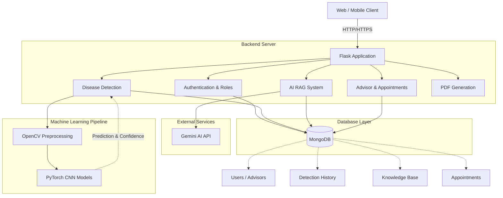
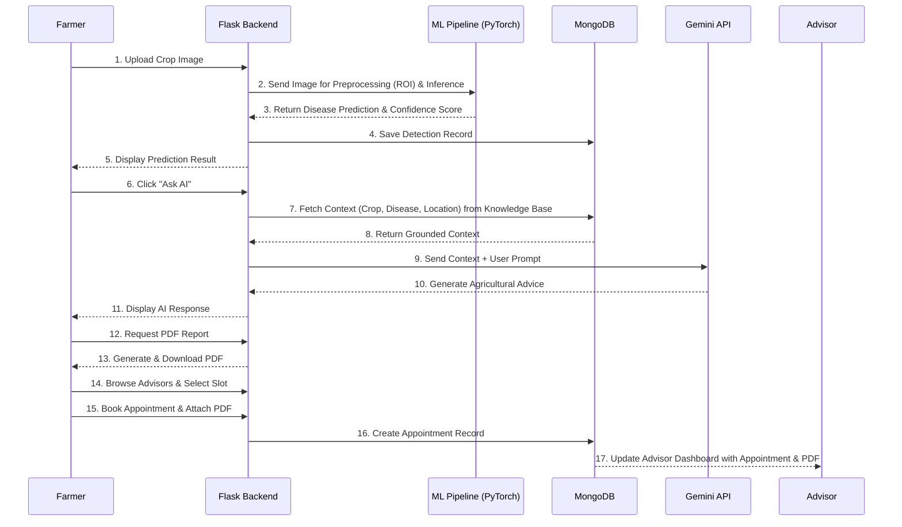

# Master Architecture and Implementation Plan

## Overview
CropCare AI is an explainable crop disease detection and decision-support system. It integrates CNN-based image classification (VGG-16 with Attention Mechanism / MobileNetV2), RAG-based AI decision support, and a role-based consultation system (Farmers and Agricultural Advisors).

## 1. High-Level Architecture
The architecture relies on a Flask backend, a MongoDB database for storage, a PyTorch ML pipeline for inference, and the Gemini API for the RAG-based AI system.



## 2. Folder Structure
```
app/
├── __init__.py          # Flask app factory and DB initialization
├── ml/                  # Machine Learning pipeline
│   ├── cnn_model.py     # PyTorch model definitions
│   ├── image_utils.py   # OpenCV ROI extraction & Preprocessing
│   ├── inference.py     # Prediction pipeline
│   ├── train_model.py   # Training script for models
│   └── *.pth            # Model weights (MobileNetV2, Checkpoints)
├── models/              # MongoDB data access layers
│   ├── appointment.py   # Booking and scheduling logic
│   ├── detection.py     # Inference history
│   └── user.py          # User & Advisor schema and methods
├── routes/              # Modular routing (Blueprints)
│   ├── advisor.py       # Advisor listing, Appointment booking
│   ├── ai.py            # Gemini AI RAG endpoint
│   ├── auth.py          # Authentication & Role management
│   ├── detection.py     # Image upload, CNN inference, Results
│   ├── main.py          # Dashboard & Core pages
│   └── report.py        # PDF generation and handling
├── static/              # Frontend assets
│   ├── css/style.css    # Responsive, mobile-first design
│   ├── images/          # Static images
│   ├── js/              # Client-side interactions
│   └── uploads/         # Temporary storage for uploaded images & generated PDFs
├── templates/           # Jinja2 HTML templates
│   ├── base.html        # Main layout
│   ├── index.html       # Landing Page
│   ├── login.html, register*.html # Auth Views
│   ├── dashboard.html   # Role-specific dashboard
│   ├── detection.html, result.html # ML flow
│   ├── ask_ai.html      # RAG interface
│   └── advisor_list.html, book_appointment.html # Appointments
└── utils/               # Helper utilities
```

## 3. MongoDB Collections and Relationships
- **users**: `_id`, `name`, `email`, `password_hash`, `role` (user/advisor), `location_details`.
- **advisors**: Extension of user. Stores `experience`, `qualification`, `specializations`, `availability_slots`.
- **detections**: `_id`, `user_id` (ref: users), `crop`, `disease_predicted`, `confidence`, `image_path`, `timestamp`.
- **appointments**: `_id`, `farmer_id` (ref: users), `advisor_id` (ref: users), `date_time`, `status`, `report_pdf_path`.
- **ai_chats**: `_id`, `user_id`, `context` (crop/disease), `chat_history`.
- **knowledge_base**: Curated data for RAG (crop, disease, symptoms, prevention, management).

## 4. Flows and Data Flow Diagram

### Data Flow Diagram


### Authentication & User Role Flow
- **Registration**: User selects role (Farmer or Advisor). Advisors provide additional details.
- **Login**: Verifies hashed password and sets `session['role']`.
- **Authorization**: Flask routes use decorators to restrict access (e.g., only Advisors can see the Advisor Dashboard).

### CNN Integration & Disease Detection Flow
1. User uploads a crop leaf image via the frontend.
2. `detection.py` route saves the image temporarily to `static/uploads/`.
3. `image_utils.py` applies OpenCV preprocessing (ROI extraction).
4. `inference.py` passes the tensor through the PyTorch model.
5. The model outputs a prediction label and confidence score.
6. If confidence > threshold, display the result; else, request a clearer image.

### RAG/AI Flow (Ask AI)
1. User clicks "Ask AI" from a positive disease result.
2. The frontend sends `crop`, `disease`, and `location` as hidden context.
3. `ai.py` queries the `knowledge_base` collection to retrieve grounded context.
4. Gemini API receives the grounded context + user prompt to generate safe, agricultural-specific advice.

### PDF Report & Upload Flow
1. User requests a report. `report.py` compiles detection details, user info, and recommended actions into a PDF.
2. The PDF is saved locally/provided for download in `static/uploads/`.
3. When booking an appointment, the user can attach this PDF.
4. The Advisor can download and view the PDF from their dashboard.

### Advisor & Appointment Flow
1. Farmer browses advisors filtered by specialization/location (`advisor_list.html`).
2. Farmer views available slots.
3. Farmer selects a slot and attaches the PDF report (`book_appointment.html`).
4. `appointment.py` checks for double-booking and creates the record.
5. Advisor dashboard displays the upcoming appointment and attached PDF.

## 5. Mobile Responsive UI Structure
- **CSS Strategy**: Mobile-first media queries (`@media (min-width: 768px)`).
- **Aesthetics**: Glassmorphism (`backdrop-filter: blur`), vibrant harmonious colors (greens for agriculture), and fluid typography (Inter font).
- **Components**: Flexible grid/flexbox for dashboard cards, off-canvas menu for mobile navigation.

## Implementation Order
1. **Phase 2: ML Pipeline**: Build the PyTorch VGG-16 + Attention / MobileNetV2 architecture, integrate OpenCV for ROI, and create the upload/detection endpoints.
2. **Phase 3: RAG & PDF**: Implement the PDF generator and the Gemini API RAG chatbot interface.
3. **Phase 4: Advisor System**: Build the Advisor profiles, search functionality, and the appointment booking system with double-booking prevention.
4. **Phase 5: Polish & UI**: Finalize the mobile-responsive Glassmorphism UI and perform end-to-end testing.
