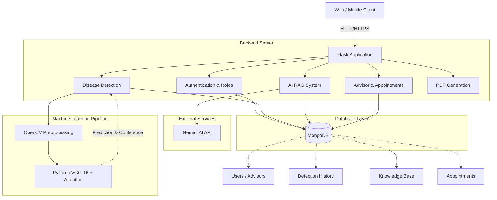
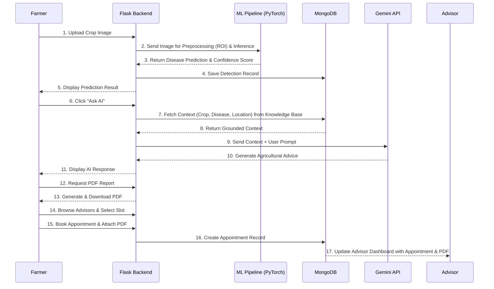

# CropCare AI Architecture & Data Flow

This document provides the high-level architecture and data flow diagrams for the CropCare AI system based on the current project structure and plans.

## High-Level Architecture

The architecture relies on a Flask backend, a MongoDB database for storage, a PyTorch ML pipeline for inference, and the Gemini API for the RAG-based AI system.

## Data Flow Diagram

This diagram illustrates how data moves through the system from the moment a user uploads a crop leaf image to generating a report and booking an advisor.

